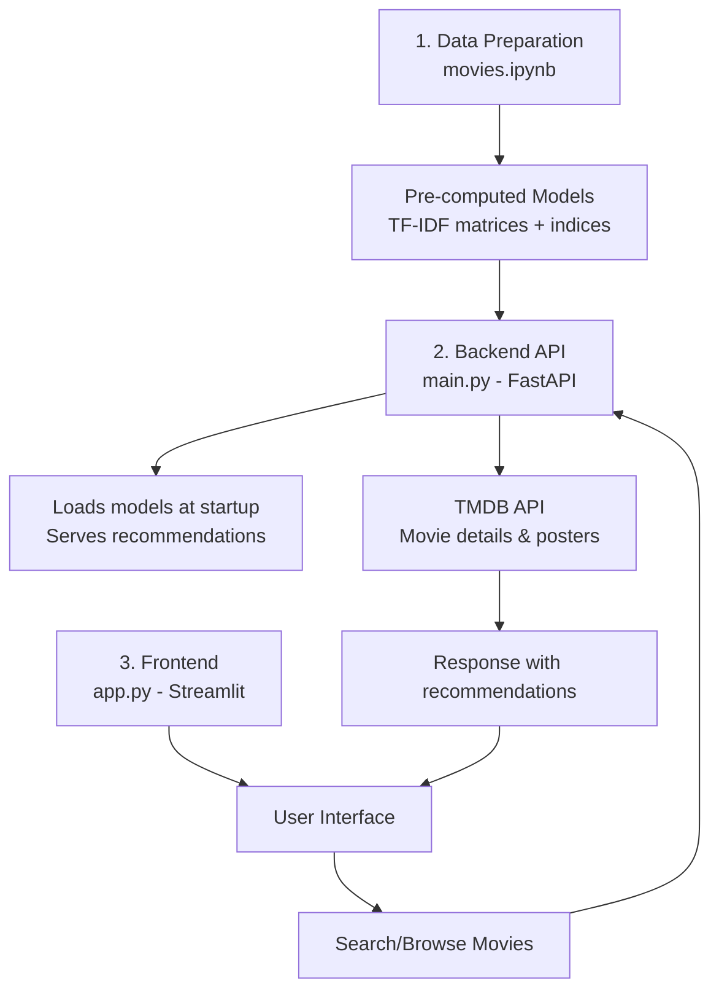

# Movie Recommendation System

An end-to-end movie recommendation system using NLP (TF-IDF), FastAPI for the backend API, and Streamlit for the frontend interface.

## Project Structure

- `main.py`: FastAPI backend server.
- `app.py`: Streamlit frontend application.
- `movies.ipynb`: Jupyter notebook for data exploration and model training.
- `movies_metadata.csv`: Dataset containing movie information.
- `*.pkl`: Pre-computed TF-IDF matrices and data structures for fast recommendations.

## Prerequisites

- Python 3.8 or higher.
- A TMDB API Key (required, because backend startup fails if missing).

## Architecture Overview

The system consists of three main components working together:



**Key Flows:**

1. **Data Preparation** (`movies.ipynb`): Cleans movie data and generates TF-IDF models stored as pickle files for fast reuse.

2. **Backend** (`main.py`): FastAPI server that loads pre-computed models at startup and provides endpoints for:
   - Home feed (trending, popular, etc.)
   - Movie search and details
   - Recommendations (both TF-IDF-based and genre-based)

3. **Frontend** (`app.py`): Streamlit UI where users can:
   - Browse movies by category
   - Search for movies
   - View recommendations using two methods:
     - **TF-IDF**: Content-based similarity using movie descriptions
     - **Genre**: TMDB genre discovery for related movies
<!-- 
## Runtime Sequence (What Happens on a Real User Click)

```mermaid
sequenceDiagram
	autonumber
	participant U as User
	participant S as Streamlit (app.py)
	participant F as FastAPI (main.py)
	participant T as TMDB API
	participant L as Local TF-IDF Artifacts

	U->>S: Type keyword in search box
	S->>F: GET /tmdb/search?query=...
	F->>T: /search/movie
	T-->>F: Search results
	F-->>S: Raw TMDB JSON
	S-->>U: Suggestions + result grid

	U->>S: Select movie / click Open
	S->>F: GET /movie/id/{tmdb_id}
	F->>T: /movie/{id}
	T-->>F: Movie details
	F-->>S: Details payload
	S-->>U: Details view render

	S->>F: GET /movie/search?query=movie_title
	F->>T: Find best TMDB match + movie details
	F->>L: Resolve title index + compute TF-IDF similarity
	F->>T: Attach posters for TF-IDF titles + genre discovery
	F-->>S: Bundle (details + tfidf_recs + genre_recs)
	S-->>U: Show both recommendation sections

	Note over S,F: If bundle fails in UI, Streamlit calls /recommend/genre as fallback
``` -->

## Component Responsibilities

- Streamlit (`app.py`): UI rendering, routing with query params, search suggestions, poster grids, details page orchestration, and client-side fallback logic.
- FastAPI (`main.py`): API contract, startup loading of pickle artifacts, TMDB proxy calls, TF-IDF scoring, response shaping, and robust exception handling.
- Offline notebook (`movies.ipynb`): one-time or periodic training/precomputation pipeline that generates serialized artifacts for fast runtime inference.
- Serialized artifacts (`df.pkl`, `indices.pkl`, `tfidf.pkl`, `tfidf_matrix.pkl`): immutable runtime assets loaded once at startup to avoid recomputation.
- TMDB external service: fresh details, posters/backdrops, trending/home feeds, and genre discovery recommendations.

## API Surface Summary

- `GET /health`: service health check.
- `GET /home`: home feed cards from TMDB categories (`trending`, `popular`, `top_rated`, `now_playing`, `upcoming`).
- `GET /tmdb/search`: keyword-based raw TMDB search (used for suggestions and result grid).
- `GET /movie/id/{tmdb_id}`: safe movie details endpoint.
- `GET /recommend/genre`: genre-based recommendations from TMDB discover endpoint.
- `GET /recommend/tfidf`: local TF-IDF recommendation titles and scores (debug/useful endpoint).
- `GET /movie/search`: bundled endpoint returning movie details + TF-IDF recs + genre recs.

## Setup and Installation

Follow these steps to run the project locally.

### 1. Clone the Repository

```bash
git clone <repository-url>
cd movie-rec-main
```

### 2. Create a Virtual Environment (Recommended)

```bash
python -m venv venv
# On Windows:
.\venv\Scripts\activate
# On macOS/Linux:
source venv/bin/activate
```

### 3. Install Dependencies

```bash
pip install -r requirements.txt
```

### 4. Configuration

Create a `.env` file in the root directory:

```env
TMDB_API_KEY=your_api_key_here
```

If no API key is provided, backend startup will fail early by design.

### 5. Prepare Data Artifacts (Optional)

The repository already includes precomputed artifacts. Re-run the notebook only if you want to rebuild them.

- Open `movies.ipynb`.
- Run all cells to regenerate `df.pkl`, `indices.pkl`, `tfidf.pkl`, `tfidf_matrix.pkl`.

## Running the Application

Run backend and frontend in separate terminals.

### 1. Start FastAPI Backend

```bash
uvicorn main:app --reload
```

Backend URLs:

- API base: `http://127.0.0.1:8000`
- Swagger docs: `http://127.0.0.1:8000/docs`

### 2. Start Streamlit Frontend

```bash
streamlit run app.py
```

Frontend URL:

- Streamlit UI: `http://localhost:8501`

## Notes for Deployment

- `app.py` currently points `API_BASE` to a hosted Render URL first, then local URL fallback expression.
- For local-only runs, set `API_BASE` explicitly to `http://127.0.0.1:8000` in `app.py`.
- Keep `.env` out of version control.
